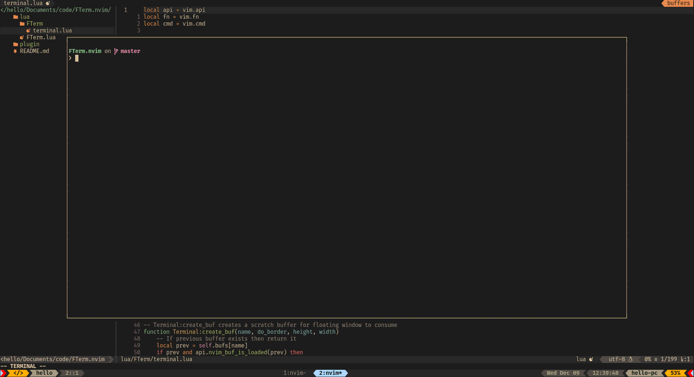

<h1 align='center'>FTerm.nvim</h1>

<h4 align='center'>No nonsense floating terminal written in lua.</h4>



### Requirements

-   Neovim Nightly

### Install

-   With [vim-plug](https://github.com/junegunn/vim-plug)

```vim
Plug 'numtostr/FTerm.nvim'
```

-   With [packer.nvim](https://github.com/wbthomason/packer.nvim)

```vim
use 'numtostr/FTerm.nvim'
```

### Usage

-   To open the terminal

```
:FTermOpen
```

-   To close the terminal

```
:FTermClose
```

> Actually this closes the floating window not the actual terminal buffer

-   To toggle the terminal

```
:FTermToggle
```

### Setup

```lua

-- Default dimensions, you can customize them individually
-- NOTE: No need to call .setup() if you don't want to customize
require'FTerm'.setup({
    dimensions  = {
        height = 0.8,
        width = 0.8,
        row = 0.5,
        col = 0.5
    }
})

-- Keybinding

-- Closer to the metal
vim.fn.nvim_set_keymap('n', '<A-i>', '<CMD>lua require"FTerm".toggle()<CR>', { noremap = true, silent = true })
vim.fn.nvim_set_keymap('t', '<A-i>', '<C-\\><C-n>lua require"FTerm".toggle()<CR>', { noremap = true, silent = true })

-- or

vim.fn.nvim_set_keymap('n', '<A-i>', ':FTermToggle<CR>', { noremap = true, silent = true })
vim.fn.nvim_set_keymap('t', '<A-i>', '<C-\\><C-n>:FTermToggle<CR>', { noremap = true, silent = true })
```
